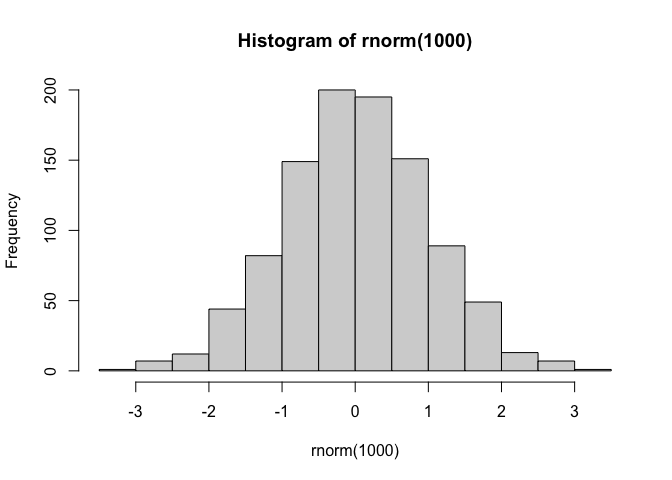
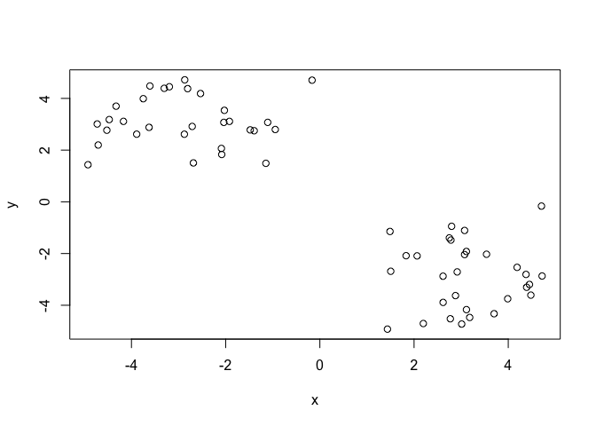
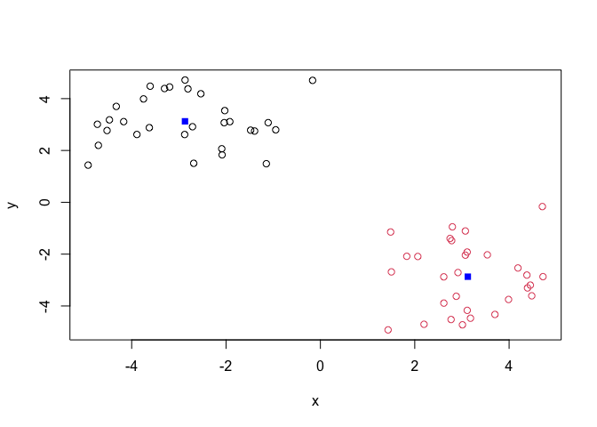
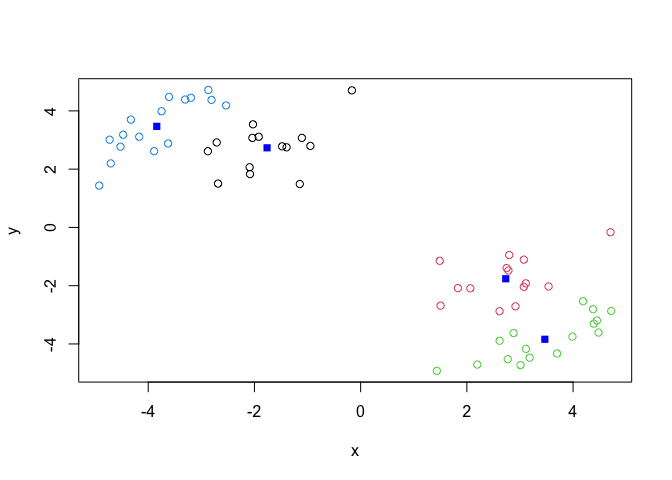
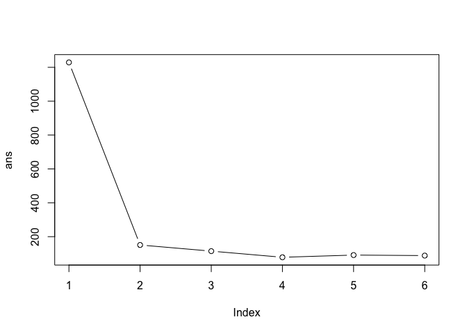
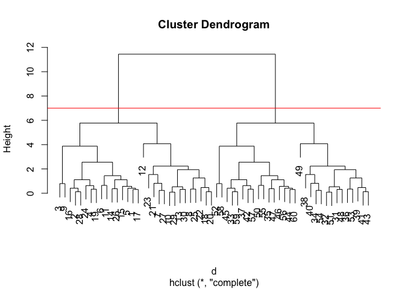
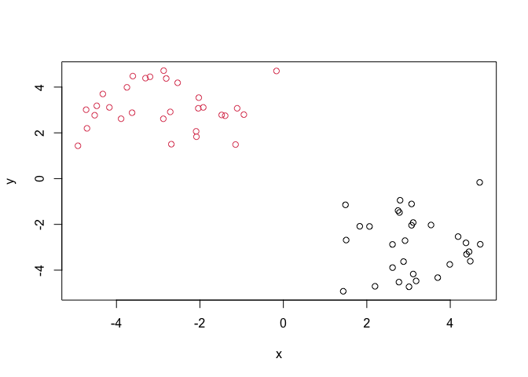
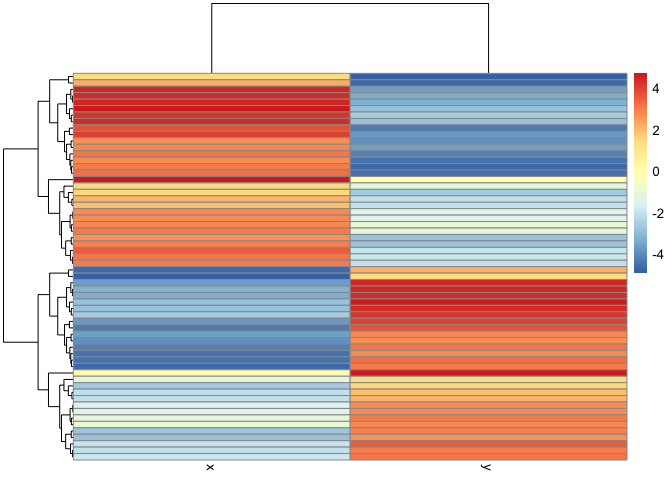
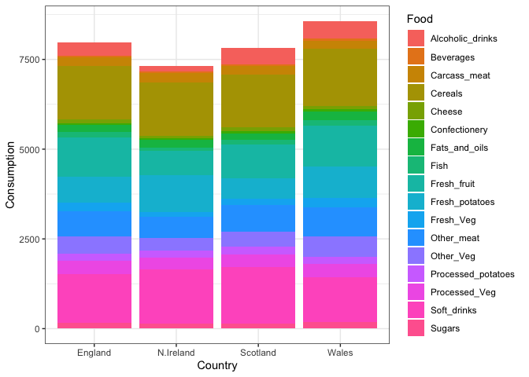
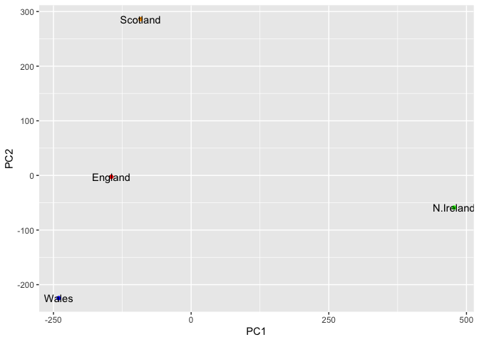

# Class07: Machine Learning 1
Montserrat (A16536527)

Today we will begin our exploration of some “classical” machine learning
approaches. we will start with clustering:

Lets first make up some data to cluster where we know what the answer
should be

``` r
#rnorm(1000)
hist(rnorm(1000))
```



``` r
x <-c(rnorm(30,mean=3),rnorm(30, mean=-3))
y <- rev(x)

x <-cbind(x,y)
#c in cbind stands for column bind so rbind is row bind, puts them side to side
```

A wee peak at x with `plot(x)`

``` r
plot(x)
```



The main function in “base” R for K-mean clustering is called `kmeans()`

``` r
kmeans(x,centers=2)
```

    K-means clustering with 2 clusters of sizes 30, 30

    Cluster means:
              x         y
    1 -2.870048  3.124812
    2  3.124812 -2.870048

    Clustering vector:
     [1] 2 2 2 2 2 2 2 2 2 2 2 2 2 2 2 2 2 2 2 2 2 2 2 2 2 2 2 2 2 2 1 1 1 1 1 1 1 1
    [39] 1 1 1 1 1 1 1 1 1 1 1 1 1 1 1 1 1 1 1 1 1 1

    Within cluster sum of squares by cluster:
    [1] 75.40741 75.40741
     (between_SS / total_SS =  87.7 %)

    Available components:

    [1] "cluster"      "centers"      "totss"        "withinss"     "tot.withinss"
    [6] "betweenss"    "size"         "iter"         "ifault"      

``` r
k<-kmeans(x,centers=2)
# only 2 required arguments, x and centers
```

> Q. how big are the clusters (i.e their size?)

``` r
k$size
```

    [1] 30 30

> Q clusters?

``` r
k$cluster
```

     [1] 2 2 2 2 2 2 2 2 2 2 2 2 2 2 2 2 2 2 2 2 2 2 2 2 2 2 2 2 2 2 1 1 1 1 1 1 1 1
    [39] 1 1 1 1 1 1 1 1 1 1 1 1 1 1 1 1 1 1 1 1 1 1

``` r
k
```

    K-means clustering with 2 clusters of sizes 30, 30

    Cluster means:
              x         y
    1 -2.870048  3.124812
    2  3.124812 -2.870048

    Clustering vector:
     [1] 2 2 2 2 2 2 2 2 2 2 2 2 2 2 2 2 2 2 2 2 2 2 2 2 2 2 2 2 2 2 1 1 1 1 1 1 1 1
    [39] 1 1 1 1 1 1 1 1 1 1 1 1 1 1 1 1 1 1 1 1 1 1

    Within cluster sum of squares by cluster:
    [1] 75.40741 75.40741
     (between_SS / total_SS =  87.7 %)

    Available components:

    [1] "cluster"      "centers"      "totss"        "withinss"     "tot.withinss"
    [6] "betweenss"    "size"         "iter"         "ifault"      

> Q. make a plot of our data colored by cluster assignment– i.e. make a
> result figure

``` r
plot(x,col=k$cluster)
points(k$centers,col="blue",pch=15)
```



> Q. cluster with k-means into 4 clusters and plot your results as
> above?

``` r
k4 <-kmeans(x,centers=4)
plot(x,col=k4$cluster)
points(k4$centers,col="blue",pch=15)
```



> Q. run kmeans with centers(i.e. values of k) equal 1 to 6

``` r
k1 <- kmeans(x,centers=1)$tot.withinss
k2 <- kmeans(x,centers=2)$tot.withinss
k3 <-kmeans(x,centers=3)$tot.withinss
k4 <- kmeans(x,centers=4)$tot.withinss
k5 <- kmeans(x,centers=5)$tot.withinss
k6 <- kmeans(x,centers=6)$tot.withinss

ans <- c(k1,k2,k3,k4,k5,k6)
```

or use a for loop

``` r
ans <- NULL
for(i in 1:6) {
  ans <- c(ans,kmeans(x,centers=i)$tot.withinss)
}
```

Make a “scree-plot’

``` r
plot(ans,typ="b")
```



## Hierarchical Clustering

The main function in “base: R for this is called `hclust` help key =

``` r
#dist(x)
d<-dist(x)
hc<-hclust(d)
hc
```


    Call:
    hclust(d = d)

    Cluster method   : complete 
    Distance         : euclidean 
    Number of objects: 60 

``` r
plot(hc)
abline(h=7,col="red")
```



to obtain clusters from our `hclut` result object **hc** we “cut” the
tree to yield diffferent subbranches. for this we use the `cutree()`

``` r
grps <- cutree(hc,h=7)
plot(x, col=grps)
```



kmeans(x,centers=) hclust(dist(x))

``` r
library(pheatmap)
pheatmap(x)
```



## Principal Component Analysis (PCA)

``` r
url <- "https://tinyurl.com/UK-foods"
x <- read.csv(url)
```

> Q1. How many rows and columns are in your new data frame named x? What
> R functions could you use to answer this questions?

``` r
dim(x)
```

    [1] 17  5

``` r
#preview the first 6 rows 
head(x)
```

                   X England Wales Scotland N.Ireland
    1         Cheese     105   103      103        66
    2  Carcass_meat      245   227      242       267
    3    Other_meat      685   803      750       586
    4           Fish     147   160      122        93
    5 Fats_and_oils      193   235      184       209
    6         Sugars     156   175      147       139

``` r
# Note how the minus indexing works
rownames(x) <- x[,1]
x <- x[,-1]
head(x)
```

                   England Wales Scotland N.Ireland
    Cheese             105   103      103        66
    Carcass_meat       245   227      242       267
    Other_meat         685   803      750       586
    Fish               147   160      122        93
    Fats_and_oils      193   235      184       209
    Sugars             156   175      147       139

``` r
#alternative approach to setting correct row names 
#x <- read.csv(url, row.names=1)
#head(x)
```

> Q2. Which approach to solving the ‘row-names problem’ mentioned above
> do you prefer and why? Is one approach more robust than another under
> certain circumstances?

I prefer the second choice because it is more robust and running x \<-
x\[,-1\]) leads to elimation of one column every time you run it

``` r
# Using base R
barplot(as.matrix(x), beside=T, col=rainbow(nrow(x)))
```


``` r
barplot(as.matrix(x), col=rainbow(nrow(x)))
```


> Q3: Changing what optional argument in the above barplot() function
> results in the following plot?

remove `beside=T`

## Side-note: Using ggplot and the need for “tidy” data

``` r
# Currently we have wide format
dim(x)
```

    [1] 17  4

``` r
head(x)
```

                   England Wales Scotland N.Ireland
    Cheese             105   103      103        66
    Carcass_meat       245   227      242       267
    Other_meat         685   803      750       586
    Fish               147   160      122        93
    Fats_and_oils      193   235      184       209
    Sugars             156   175      147       139

``` r
library(tidyr)

# Convert data to long format for ggplot with `pivot_longer()`
x_long <- x |> 
          tibble::rownames_to_column("Food") |> 
          pivot_longer(cols = -Food, 
                       names_to = "Country", 
                       values_to = "Consumption")

dim(x_long)
```

    [1] 68  3

``` r
head(x_long)
```

    # A tibble: 6 × 3
      Food            Country   Consumption
      <chr>           <chr>           <int>
    1 "Cheese"        England           105
    2 "Cheese"        Wales             103
    3 "Cheese"        Scotland          103
    4 "Cheese"        N.Ireland          66
    5 "Carcass_meat " England           245
    6 "Carcass_meat " Wales             227

``` r
# Create grouped bar plot
library(ggplot2)
```

    Warning: package 'ggplot2' was built under R version 4.5.2

``` r
ggplot(x_long) +
  aes(x = Country, y = Consumption, fill = Food) +
  geom_col(position = "dodge") +
  theme_bw()
```


> Q4: Changing what optional argument in the above ggplot() code results
> in a stacked barplot figure?

``` r
ggplot(x_long) +
  aes(x = Country, y = Consumption, fill = Food) +
  geom_col(position = "stack") +
  theme_bw()
```



> Q5: We can use the pairs() function to generate all pairwise plots for
> our countries. Can you make sense of the following code and resulting
> figure? What does it mean if a given point lies on the diagonal for a
> given plot?

``` r
pairs(x, col=rainbow(nrow(x)), pch=16)
```


``` r
library(pheatmap)

pheatmap( as.matrix(x) )
```


> Q6. Based on the pairs and heatmap figures, which countries cluster
> together and what does this suggest about their food consumption
> patterns? Can you easily tell what the main differences between N.
> Ireland and the other countries of the UK in terms of this data-set?

It looks like Wales and England are quite similar in their consumption
of these food but still difficult to tell what is going on in the
dataset

\##PCA to the rescue

The main function in “base” R for PCA is called `prcomp()`

as we want to do PCA on the food data across countries for the different
countries we will want the foods in the columns

``` r
pca<- prcomp(t(x))
summary(pca)
```

    Importance of components:
                                PC1      PC2      PC3       PC4
    Standard deviation     324.1502 212.7478 73.87622 2.921e-14
    Proportion of Variance   0.6744   0.2905  0.03503 0.000e+00
    Cumulative Proportion    0.6744   0.9650  1.00000 1.000e+00

telling you the first one captures about 67% of variance, PC2 abouot 29%
and so on

Our result object is called `pca` and it has a `$x` component that we
will look at first

``` r
pca$x
```

                     PC1         PC2        PC3           PC4
    England   -144.99315   -2.532999 105.768945 -9.152022e-15
    Wales     -240.52915 -224.646925 -56.475555  5.560040e-13
    Scotland   -91.86934  286.081786 -44.415495 -6.638419e-13
    N.Ireland  477.39164  -58.901862  -4.877895  1.329771e-13

``` r
cols <- c("red","blue","orange","green")
ggplot(pca$x)+
  aes(PC1,PC2,label=rownames(pca$x))+
  geom_point(col=cols)+ geom_text()
```



Another major result out of PCA is the so called “variable loadings” or
`$rotation`. tells us how the original variables (foods) contribute PCs
(i.e. our new axis)

``` r
pca$rotation
```

                                 PC1          PC2         PC3          PC4
    Cheese              -0.056955380  0.016012850  0.02394295 -0.409382587
    Carcass_meat         0.047927628  0.013915823  0.06367111  0.729481922
    Other_meat          -0.258916658 -0.015331138 -0.55384854  0.331001134
    Fish                -0.084414983 -0.050754947  0.03906481  0.022375878
    Fats_and_oils       -0.005193623 -0.095388656 -0.12522257  0.034512161
    Sugars              -0.037620983 -0.043021699 -0.03605745  0.024943337
    Fresh_potatoes       0.401402060 -0.715017078 -0.20668248  0.021396007
    Fresh_Veg           -0.151849942 -0.144900268  0.21382237  0.001606882
    Other_Veg           -0.243593729 -0.225450923 -0.05332841  0.031153231
    Processed_potatoes  -0.026886233  0.042850761 -0.07364902 -0.017379680
    Processed_Veg       -0.036488269 -0.045451802  0.05289191  0.021250980
    Fresh_fruit         -0.632640898 -0.177740743  0.40012865  0.227657348
    Cereals             -0.047702858 -0.212599678 -0.35884921  0.100043319
    Beverages           -0.026187756 -0.030560542 -0.04135860 -0.018382072
    Soft_drinks          0.232244140  0.555124311 -0.16942648  0.222319484
    Alcoholic_drinks    -0.463968168  0.113536523 -0.49858320 -0.273126013
    Confectionery       -0.029650201  0.005949921 -0.05232164  0.001890737

``` r
ggplot(pca$rotation) +aes(PC1, rownames(pca$rotation)) + geom_col()
```


