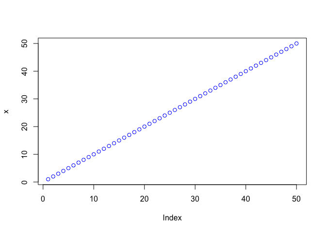
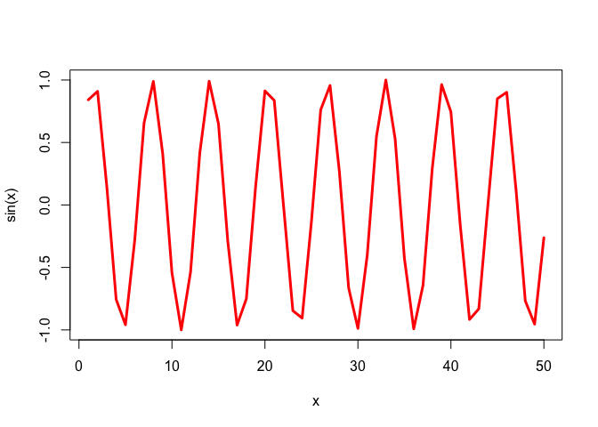

# Class 4
Montserrat (A16536527)

``` r
#This is my first R script 
x <- 1:50
plot(x)
```


``` r
plot(x,col="blue")
```



``` r
#change color use col
plot(x, sin(x), type = "l",col="red",lwd=3)
```



``` r
log(10)
```

    [1] 2.302585

``` r
log(10,base=10)
```

    [1] 1

``` r
log(10,2)
```

    [1] 3.321928
