# Class05: Data Viz with GGPLOT
Montserrat (PID:A16536527)

Today we playing with plotting and graphics in E

There are lots of ways to make cool figures in T There is “base” R
graphics (`plot()`, `hist()`, `boxplot()` etc.)

there is also add-on packages like **ggplot**

``` r
head(cars)
```

      speed dist
    1     4    2
    2     4   10
    3     7    4
    4     7   22
    5     8   16
    6     9   10

lets plot with this “base” R:

option command i = insert code

``` r
plot(cars)
```


``` r
head(mtcars)
```

                       mpg cyl disp  hp drat    wt  qsec vs am gear carb
    Mazda RX4         21.0   6  160 110 3.90 2.620 16.46  0  1    4    4
    Mazda RX4 Wag     21.0   6  160 110 3.90 2.875 17.02  0  1    4    4
    Datsun 710        22.8   4  108  93 3.85 2.320 18.61  1  1    4    1
    Hornet 4 Drive    21.4   6  258 110 3.08 3.215 19.44  1  0    3    1
    Hornet Sportabout 18.7   8  360 175 3.15 3.440 17.02  0  0    3    2
    Valiant           18.1   6  225 105 2.76 3.460 20.22  1  0    3    1

lets plot `mpg` vs `disp` pch number can be changed to adjust figure for
points

``` r
plot(mtcars$mpg,mtcars$disp,pch=12)
```

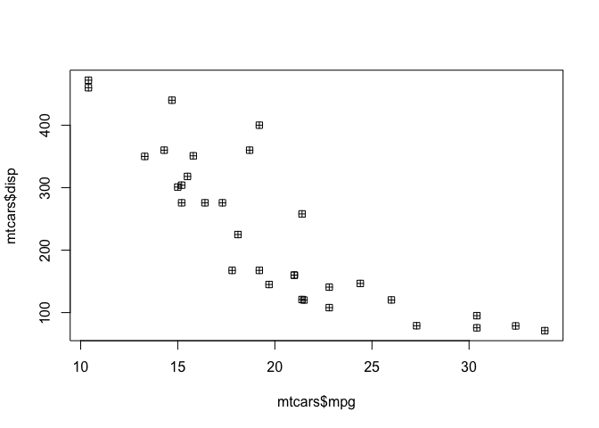

``` r
hist(mtcars$mpg)
```


\##GGPLOT

the main function in the ggplot2 package is \*\*ggplot()\*. First i need
to install the ggplot2 package. i can install any package with the
function `install.packages()` ( do this in the console)

> **N.B.** i never want to run `install.packages()` in my quarto source
> document

you need to load the package before attempting to use

``` r
library(ggplot2)
```

    Warning: package 'ggplot2' was built under R version 4.5.2

``` r
ggplot(cars)+
  aes(x=speed,y=dist)+
  geom_point()
```


every ggplot needas at least 3 things: data, = **data** (given with
`ggplot(cars)`) -the **aesthetic** mapping (given with `aes()`) -the
**geom** (given by `geom_point()`)

> for simple canned graphs “base” R is near always faster

``` r
ggplot(cars)+
  aes(speed)+
  geom_histogram()
```

    `stat_bin()` using `bins = 30`. Pick better value `binwidth`.

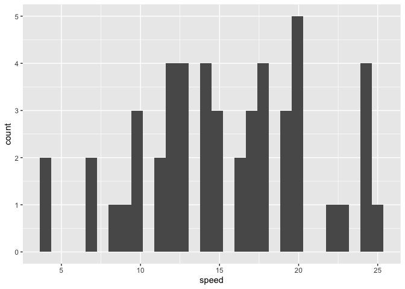

``` r
ggplot(cars)+
  aes(x=speed,y=dist)+
  geom_point()+
  geom_line()
```


### add more layers

lets add a line and title, subtitle and caption as well as custom axis
labels

``` r
ggplot(cars)+
  aes(x=speed,y=dist)+
  geom_point() + 
  geom_smooth()
```

    `geom_smooth()` using method = 'loess' and formula = 'y ~ x'

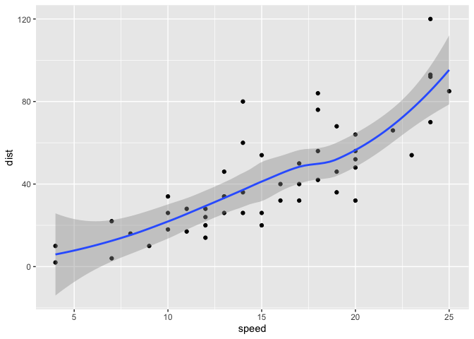

straight line, no shading

``` r
ggplot(cars)+
  aes(x=speed,y=dist)+
  geom_point()+
  geom_smooth(method="lm",se=FALSE)+
  labs(title="Silly Plot", x="Speed(MPH)", y="Distance(ft)", caption="when is tea time anyway???") +
  theme_bw()
```

    `geom_smooth()` using formula = 'y ~ x'

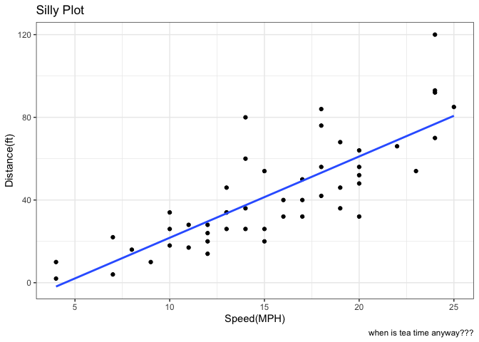

## Plot some expression data

Read data file from online URL

``` r
url <- "https://bioboot.github.io/bimm143_S20/class-material/up_down_expression.txt"
genes <- read.delim(url)
head(genes)
```

            Gene Condition1 Condition2      State
    1      A4GNT -3.6808610 -3.4401355 unchanging
    2       AAAS  4.5479580  4.3864126 unchanging
    3      AASDH  3.7190695  3.4787276 unchanging
    4       AATF  5.0784720  5.0151916 unchanging
    5       AATK  0.4711421  0.5598642 unchanging
    6 AB015752.4 -3.6808610 -3.5921390 unchanging

> Q1. how many genes are in this wee dataset?

there are 5196 in this dataset

> Q2. how may “up” regulated genes are there?

``` r
sum(genes$State =="up")
```

    [1] 127

there are 127 UP genes

``` r
table(genes$State)
```


          down unchanging         up 
            72       4997        127 

``` r
ggplot(genes) + 
    aes(x=Condition1, y=Condition2, col=State) +
    geom_point()
```

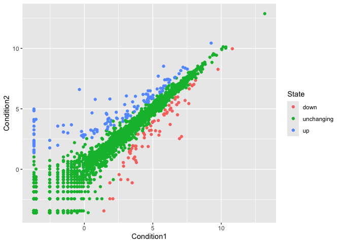

``` r
ggplot(genes) + 
    aes(x=Condition1, y=Condition2, col=Condition2) +
    geom_point()
```

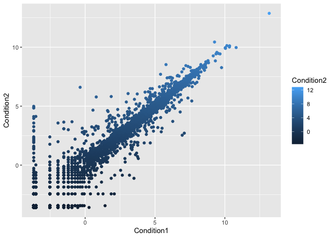

``` r
p <- ggplot(genes) + 
    aes(x=Condition1, y=Condition2, col=State) +
    geom_point()+
  scale_color_manual(values=c("blue","gray","red"))
```

``` r
p
```

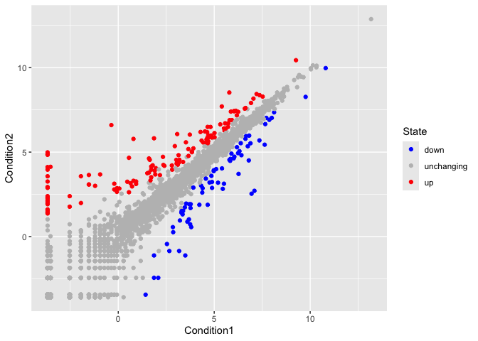

``` r
p+labs(title="look at me")
```

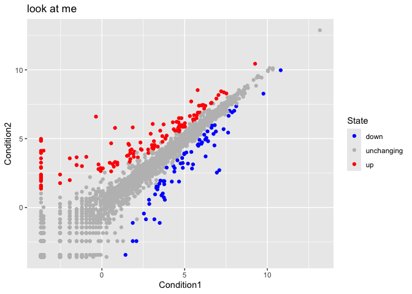

Silly example of adding labels

``` r
ggplot(genes) + 
    aes(x=Condition1, y=Condition2, col=State,label=Gene) +
    geom_point()+
  scale_color_manual(values=c("blue","gray","red"))+ 
  geom_text()
```

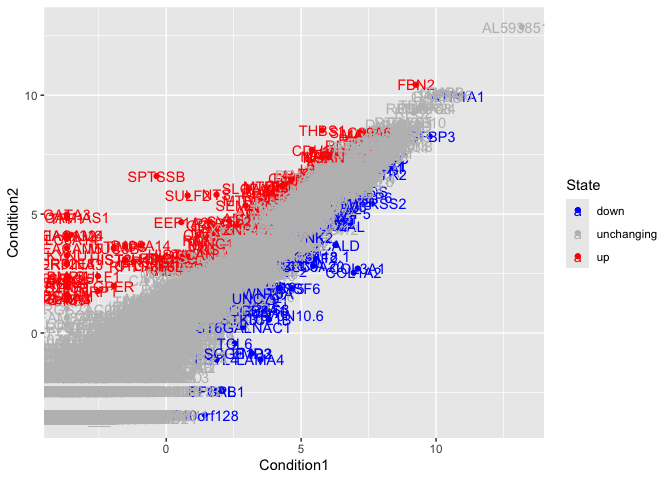

``` r
library(ggrepel)

ggplot(genes) + 
    aes(x=Condition1, y=Condition2, col=State,label=Gene) +
    geom_point()+
  scale_color_manual(values=c("blue","gray","red"))+ 
  geom_text_repel(max.overlaps = 60)+ 
  theme_bw()
```

    Warning: ggrepel: 5150 unlabeled data points (too many overlaps). Consider
    increasing max.overlaps

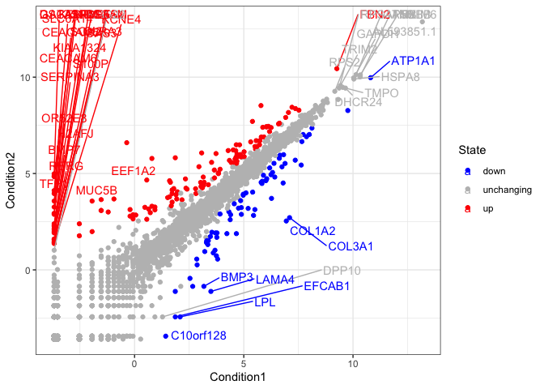

## Going Further

playing with some different layers and the gapminder dataset

``` r
# File location online
url <- "https://raw.githubusercontent.com/jennybc/gapminder/master/inst/extdata/gapminder.tsv"

gapminder <- read.delim(url)
```

``` r
tail(gapminder)
```

          country continent year lifeExp      pop gdpPercap
    1699 Zimbabwe    Africa 1982  60.363  7636524  788.8550
    1700 Zimbabwe    Africa 1987  62.351  9216418  706.1573
    1701 Zimbabwe    Africa 1992  60.377 10704340  693.4208
    1702 Zimbabwe    Africa 1997  46.809 11404948  792.4500
    1703 Zimbabwe    Africa 2002  39.989 11926563  672.0386
    1704 Zimbabwe    Africa 2007  43.487 12311143  469.7093

A first plot

``` r
ggplot(gapminder)+
  aes(y=lifeExp,x=gdpPercap, col=continent)+
  geom_point()+
  facet_wrap(~continent)
```


alpha leads do transperency

``` r
ggplot(gapminder)+
  aes(y=lifeExp,x=gdpPercap, col=continent)+
  geom_point(alpha=0.2)+
  facet_wrap(~continent)+
  theme_bw()
```

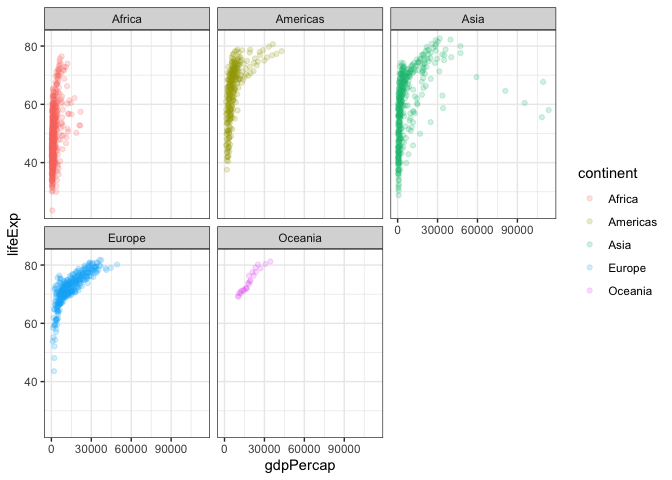

``` r
ggplot(gapminder)+
  aes(y=lifeExp,x=gdpPercap, col=continent, size=pop)+
  geom_point(alpha=0.2)+
  facet_wrap(~continent)+
  theme_bw()
```

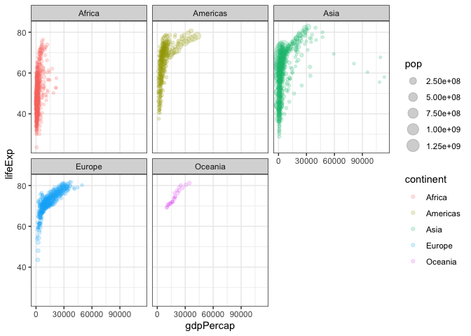

\###Extensions: Animation

``` r
library(gapminder)
```


    Attaching package: 'gapminder'

    The following object is masked _by_ '.GlobalEnv':

        gapminder

``` r
library(gganimate)
```

``` r
# Setup nice regular ggplot of the gapminder data
ggplot(gapminder, aes(gdpPercap, lifeExp, size = pop, colour = country)) +
  geom_point(alpha = 0.7, show.legend = FALSE) +
  scale_colour_manual(values = country_colors) +
  scale_size(range = c(2, 12)) +
  scale_x_log10() +
  # Facet by continent
  facet_wrap(~continent) +
  # Here comes the gganimate specific bits
  labs(title = 'Year: {frame_time}', x = 'GDP per capita', y = 'life expectancy') +
  transition_time(year) +
  shadow_wake(wake_length = 0.1, alpha = FALSE)
```

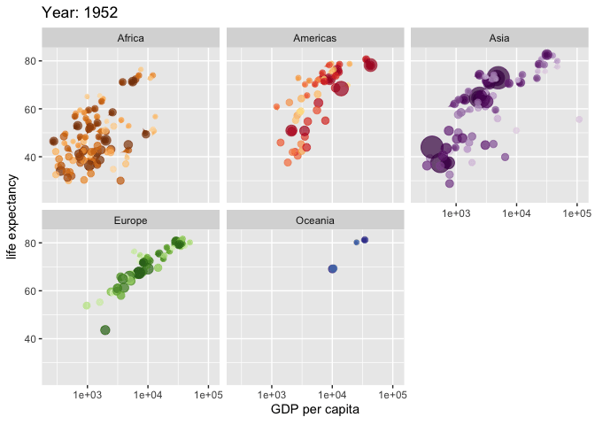

\###Combining Plots

``` r
library(dplyr)
```


    Attaching package: 'dplyr'

    The following objects are masked from 'package:stats':

        filter, lag

    The following objects are masked from 'package:base':

        intersect, setdiff, setequal, union

``` r
library(patchwork)
```

``` r
p1 <- ggplot(mtcars) + geom_point(aes(mpg, disp))
p2 <- ggplot(mtcars) + geom_boxplot(aes(gear, disp, group = gear))
p3 <- ggplot(mtcars) + geom_smooth(aes(disp, qsec))
p4 <- ggplot(mtcars) + geom_bar(aes(carb))

(p1 | p2 | p3) /
      p4
```

    `geom_smooth()` using method = 'loess' and formula = 'y ~ x'

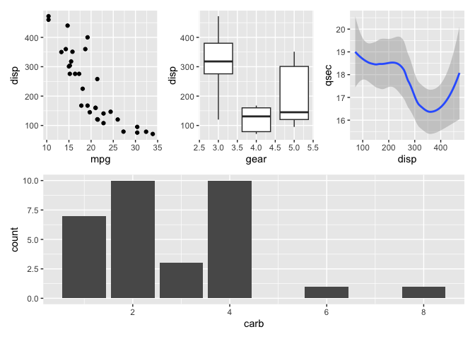
